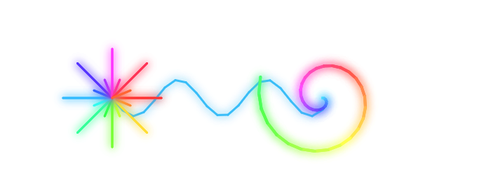

# Google Antigravity `/browser` Skill Verification Proof

Visual verification proof for the `/browser` skill implemented in [`saariuslystoned/SaariusSkills`](https://github.com/saariuslystoned/SaariusSkills).

## Verified Interaction Matrix

| # | Interaction Category | Target Elements & Actions | Execution Verdict |
|---|---|---|---|
| **1** | **Text Typing & Inputs** | Populated `AGENT CODENAME` (`Nexus-9 Cyber Sentinel`), `DIRECT COMM CHANNEL` (`nexus9@autonomous.mesh`), and multiline `TACTICAL OBJECTIVE & DIRECTIVES` | **PASS** |
| **2** | **Checkboxes & Radios** | Selected `Generative Artificer` mode, toggled `Quantum Emerald` theme radio, enabled `2D Vector Acceleration` & `Telemetry` checkboxes | **PASS** |
| **3** | **Action Buttons & Clicks** | Clicked `⚡ Apply Directives` to sync Agent Passport HUD, toggled `Rainbow Trail` brush mode, triggered vector presets | **PASS** |
| **4** | **Drag & Drop Interaction** | Dragged `🔐 Cryptographic Security Key` onto `⬇ Drop Security Key Here to Authorize Matrix` -> `✅ MATRIX AUTHORIZATION VERIFIED [TOKEN_779 ACCEPTED]` | **PASS** |
| **5** | **Vector Canvas Drawing** | Rendered radiant starbursts, 40-node Archimedean spiral, and neural resonance wave (133+ strokes) | **PASS** |
| **6** | **Proof Capture** | Captured full-page visual proof screenshot and real-time telemetry event logs via DevTools MCP | **PASS** |

## Visual Proof Artifacts

- **Full Verification Studio Demo**: `agy-browser-skill-demo.png`
- **Dynamic HTML5 Canvas Vector Render**: `canvas-vector-proof.png`

